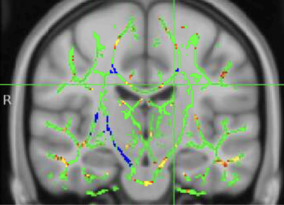

# FSL Use Overview

This folder contains one example of my use of **python** scripts, **unix terminal**, and an established brain data processing toolbox, **FSL** to take brain data which varied substantially between tens of patients, standardize it, extract mathematical parameters from each voxel, and conduct group tests between clinical groups. 

Multiple python scripts are represented, with function described in jupyter file `1_FSLpipeline.ipynb`
Actual scripts were run on university computers with confidential patient files.
However, a walkthrough of use of the project with images to demonstrate can be found in file `2_FSLpresentation`

**Images showing the nature of the transformations of data**

- Initial input example of raw diffusion weighted MRI scan

- Extracted mean skeleton between multiple MRIs to compare group white matter tracts

- Visualization of test results where green indicates standardized white matter tract skeleton, but yellow and blue indicate areas of significant differences between groups.
